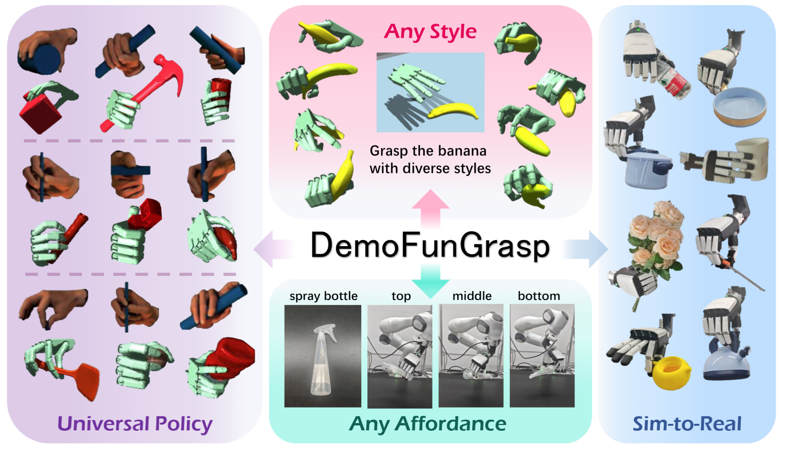

# DemoFunGrasp: Universal Dexterous Functional Grasping via Demonstration-Editing Reinforcement Learning

<div align="center">

[[Website]](https://beingbeyond.github.io/DemoFunGrasp/)
[[arXiv]](https://arxiv.org/abs/2512.13380)

[]()
[]()



</div>

DemoFunGrasp is a reinforcement learning framework for universal dexterous functional grasping. The learned policy generalizes to unseen combinations of objects and functional grasping conditions, and achieves zero-shot sim-to-real transfer. For the same object, the policy can produce diverse grasps by adjusting the grasping style and affordance.


# Citation
If you find our work useful, please consider citing us!
```
@misc{mao2025universaldexterousfunctionalgrasping,
      title={Universal Dexterous Functional Grasping via Demonstration-Editing Reinforcement Learning}, 
      author={Chuan Mao and Haoqi Yuan and Ziye Huang and Chaoyi Xu and Kai Ma and Zongqing Lu},
      year={2025},
      eprint={2512.13380},
      archivePrefix={arXiv},
      primaryClass={cs.RO},
      url={https://arxiv.org/abs/2512.13380}, 
}
```
